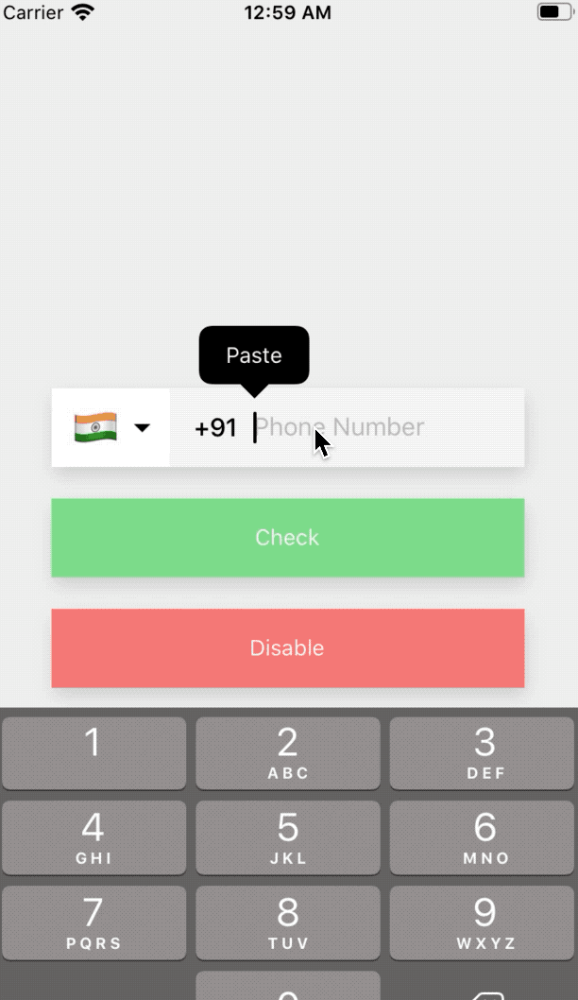
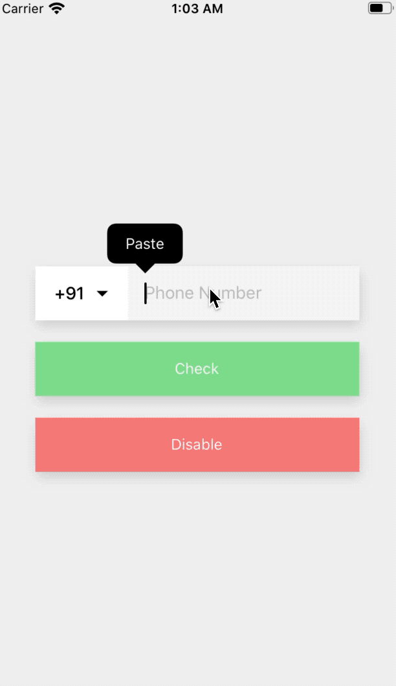

<div align="center">
  
  
</div>

<br>

<h1 align="center">React Native Phone Number Input
</h1>

<p align="center">Performance oriented React Native Phone Number Input with typings and proper validation for any country.
</p>

<h6 align="center">Made with ❤️ by developer for developers</h6>

<br>

## Want to show your love?

<p>Click on 🌟 button.</p>

## Table of Contents

- [Table of Contents](#table-of-contents)
- [Installation](#installation)
- [Features](#features)
- [Usage](#usage)
- [Props](#props)
- [Methods](#methods)
- [FAQ](#faq)
  - [Is it supported and tested both on android and iOS?](#is-it-supported-and-tested-both-on-android-and-ios)
  - [NSURLResponse allHeaderFields: unrecognized selector sent to instance XX crash?](#nsurlresponse-allheaderfields-unrecognized-selector-sent-to-instance-xx-crash)
- [Contributing](#contributing)
  - [Step 1](#step-1)
  - [Step 2](#step-2)
  - [Step 3](#step-3)
- [Support](#support)
- [License](#license)
- [Hire](#hire)

## Installation

```bash
$ yarn add react-native-phone-number-input-with-country-code
```

OR

```bash
$ npm i react-native-phone-number-input-with-country-code --save
```

## Features

- :iphone: Works with iOS and Android, Cross-platform :100:
- :crossed_flags: Built-in country picker (uses [react-native-country-picker-modal][react-native-country-picker-modal])
- :wrench: Completely customizable UI!
- :heavy_check_mark: Proper validation (uses [google-libphonenumber](https://github.com/google/libphonenumber))

## Props

- `defaultCode?`: [CountryCode](https://github.com/xcarpentier/react-native-country-picker-modal/blob/master/src/types.ts#L252)
- `withDarkTheme?`: boolean
- `withShadow?`: boolean
- `autoFocus?`: boolean
- `defaultValue?`: string
- `value?`: string
- `disabled?`: boolean
- `disableArrowIcon?`: boolean
- `placeholder?`: string;
- `onChangeCountry?`: (country: Country) => void;
- `onChangeText?`: (text: string) => void;
- `onChangeFormattedText?`: (text: string) => void;
- `containerStyle?`: `StyleProp<ViewStyle>`;
- `textContainerStyle?`: `StyleProp<ViewStyle>`;
- `renderDropdownImage?`: `JSX.Element`;
- `textInputProps?`: [TextInputProps](https://reactnative.dev/docs/textinput);
- `textInputStyle?`: `StyleProp<TextStyle>`;
- `codeTextStyle?`: `StyleProp<TextStyle>`;
- `flagButtonStyle?`: `StyleProp<ViewStyle>`;
- `countryPickerButtonStyle` : `StyleProp<ViewStyle>`;
- `layout?`: "first" | "second";
- `filterProps?`: CountryFilterProps;
- `countryPickerProps?`: any;

## Methods

- `getCountryCode`: () => [CountryCode](https://github.com/xcarpentier/react-native-country-picker-modal/blob/master/src/types.ts#L252)
- `getCallingCode`: () => string | undefined
- `getNumberAfterPossiblyEliminatingZero`: () => {number: string , formattedNumber: string };
- `isValidNumber`: (number: string) => boolean

## License

[](http://badges.mit-license.org)

- **[MIT license](http://opensource.org/licenses/mit-license.php)**

[react-native-country-picker-modal]: https://github.com/xcarpentier/react-native-country-picker-modal
